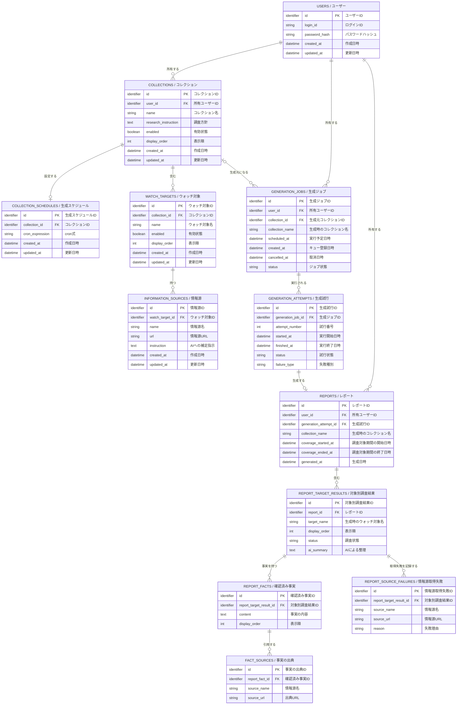

# WatchBrief ドメインモデル

> [!NOTE]
> この文書は仕様の壁打ち用ドラフトである。テーブル、カラム、保存形式は未確定であり、実装方針を決定するものではない。

## 目的

現在のコレクション設定と、生成済みの過去レポートを分けて扱う場合のデータ構造を確認する。

- コレクション、ウォッチ対象、情報源、スケジュールは次回以降の生成に使う設定。
- 生成済みレポートはDBへ保存し、閲覧時にAIや情報源を再実行しない。
- 生成時に失敗した場合はレポートを保存せず、実行結果だけを残す。

## 合意した関係

- 予定された生成を `GenerationJob`、workerによる実際の1回の実行を `GenerationAttempt` として分ける。
- 待機中に取り消されたJobにはAttemptが存在しない。実行を開始した場合は、成功・失敗にかかわらずAttemptを残す。
- Reportは、成功したGenerationAttemptにだけ0または1件紐付く。
- 初期MVPでは自動retryを行わないため、1つのJobに対するAttemptは最大1件とする。将来retryを導入する場合は、同じJobにAttemptを追加できる関係を使う。
- 生成に必要な設定は実行開始時に読み込み、メモリ上の変更されない入力として固定する。完全な入力スナップショットはDBへ保存しない。
- Collectionを削除しても、GenerationJob、GenerationAttempt、Reportは保持する。このため、実行記録は現在のCollectionへの必須リレーションを持たない。
- User、Collection、CollectionSchedule、WatchTarget、InformationSourceには、汎用的な作成日時と更新日時を持たせる。
- GenerationJob、GenerationAttempt、ReportとReport配下の記録には、一律の作成日時・更新日時を持たせず、予定日時、開始日時、終了日時、生成日時など、その記録で意味のある日時を持たせる。ただし、GenerationJobにはキューへの登録日時を表す作成日時を持たせる。
- 初期MVPでは、作成者IDと更新者IDをどのテーブルにも持たせない。将来、変更者の追跡が必要になった場合は、独立した監査記録として検討する。

検討した3案の違いは[生成記録のリレーション比較図](images/generation-record-options.svg)を参照する。

## ER図

各ボックスの見出しは `英語名 / 日本語名`、各カラムの末尾は日本語での意味を表す。英語名は実装時の候補であり、物理テーブル名・カラム名を確定するものではない。

`identifier` は抽象的なID型を表す。UUIDは使わず、ULIDまたは整数の自動採番を候補とするが、採用はDB設計時に決める。

## 読み方

- `USERS` はログイン可能な利用者。ユーザー作成とパスワード再設定は、画面ではなく管理コマンドで扱う案を検討中。
- `COLLECTIONS` はユーザーごとの調査単位。調査方針、停止状態、表示順を持つ。
- `WATCH_TARGETS` はコレクションに属する。対象をアプリ全体で共通化せず、別コレクションでは別の設定として登録する。
- `INFORMATION_SOURCES` はウォッチ対象に1件以上紐付く。名称とURLは必須、AIへの補足指示は任意とする案。
- `COLLECTION_SCHEDULES` は日本時間のcron式を表す。1コレクションに1件設定する。
- `GENERATION_JOBS` は予定された生成を表す。ユーザーに属し、待機中に取り消された場合はAttemptを作らずJobだけを残す。削除済みコレクションの予定も記録できるよう、現在のコレクション設定には必須リレーションを持たない。
- `GENERATION_ATTEMPTS` はworkerによる実際の1回の実行を表す。実行開始・終了時刻と成功・失敗などの結果を記録する。初期MVPでは1つのJobにつき最大1件だが、将来retryする場合は複数件を持てる。
- `REPORTS` は成功したGenerationAttemptにだけ紐付く生成済みレポート。ユーザーに属し、閲覧時はここに保存した結果を表示して、AIや情報源を再実行しない。
- `REPORT_TARGET_RESULTS` はレポート内の対象ごとの結果。現在のウォッチ対象設定には必須リレーションを持たず、状態、表示名、表示順、変化がある場合のAI整理を持つ。
- `REPORT_FACTS` と `FACT_SOURCES` は事実とその出典を表す。
- `REPORT_SOURCE_FAILURES` は一部情報源の取得失敗を表す。情報源の一部が失敗しても、レポート全体は保存できる案。

コレクションを削除すると、コレクション、ウォッチ対象、情報源、cronスケジュールは物理削除する。生成済みレポートと実行記録は削除せず保持する。

## DB設計で決めること

- AIが出力したMarkdownレポートをどのように保存・検証するか。構造化データを併用するかは未決定。
- GenerationJob、GenerationAttempt、Reportに、一覧表示と履歴保持のためのメタデータをどこまで重複して保存するか。
- `GENERATION_JOBS` と `GENERATION_ATTEMPTS` をどこまで画面上で表示するか。
- コレクションやスケジュールを編集した後、過去の予定の有無をどう判定するか。
- エラー分類、timeout、retry、実行キューの詳細。
