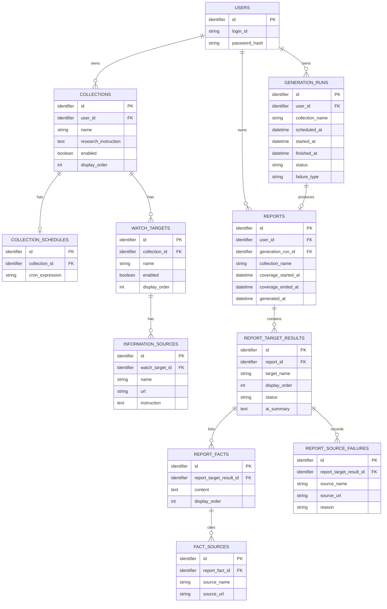

# WatchBrief ドメインモデル

> [!NOTE]
> この文書は仕様の壁打ち用ドラフトである。テーブル、カラム、保存形式は未確定であり、実装方針を決定するものではない。

## 目的

現在のコレクション設定と、生成済みの過去レポートを分けて扱う場合のデータ構造を確認する。

- コレクション、ウォッチ対象、情報源、スケジュールは次回以降の生成に使う設定。
- 生成済みレポートはDBへ保存し、閲覧時にAIや情報源を再実行しない。
- 生成時に失敗した場合はレポートを保存せず、実行結果だけを残す。

## ER図

`identifier` は抽象的なID型を表す。UUIDは使わず、ULIDまたは整数の自動採番を候補とするが、採用はDB設計時に決める。

## 読み方

- `USERS` はログイン可能な利用者。ユーザー作成とパスワード再設定は、画面ではなく管理コマンドで扱う案を検討中。
- `COLLECTIONS` はユーザーごとの調査単位。調査方針、停止状態、表示順を持つ。
- `WATCH_TARGETS` はコレクションに属する。対象をアプリ全体で共通化せず、別コレクションでは別の設定として登録する。
- `INFORMATION_SOURCES` はウォッチ対象に1件以上紐付く。名称とURLは必須、AIへの補足指示は任意とする案。
- `COLLECTION_SCHEDULES` は日本時間のcron式を表す。1コレクションに1件設定する。
- `GENERATION_RUNS` は予定ごとの生成実行。ユーザーに属し、成功、実行中、失敗、timeoutなどの結果を記録する。削除済みコレクションの実行も記録できるよう、現在のコレクション設定には必須リレーションを持たない。
- `REPORTS` は成功時に保存される生成済みレポート。ユーザーに属し、閲覧時はここに保存した結果を表示して、AIや情報源を再実行しない。
- `REPORT_TARGET_RESULTS` はレポート内の対象ごとの結果。現在のウォッチ対象設定には必須リレーションを持たず、状態、表示名、表示順、変化がある場合のAI整理を持つ。
- `REPORT_FACTS` と `FACT_SOURCES` は事実とその出典を表す。
- `REPORT_SOURCE_FAILURES` は一部情報源の取得失敗を表す。情報源の一部が失敗しても、レポート全体は保存できる案。

コレクションを削除すると、コレクション、ウォッチ対象、情報源、cronスケジュールは物理削除する。生成済みレポートと実行記録は削除せず保持する。

## DB設計で決めること

- AIが出力したMarkdownレポートをどのように保存・検証するか。構造化データを併用するかは未決定。
- レポートに現在の設定や、生成時点の設定をどこまで保存するか。
- `GENERATION_RUNS` をどこまで画面上で表示するか。
- コレクションやスケジュールを編集した後、過去の予定の有無をどう判定するか。
- エラー分類、timeout、retry、実行キューの詳細。
